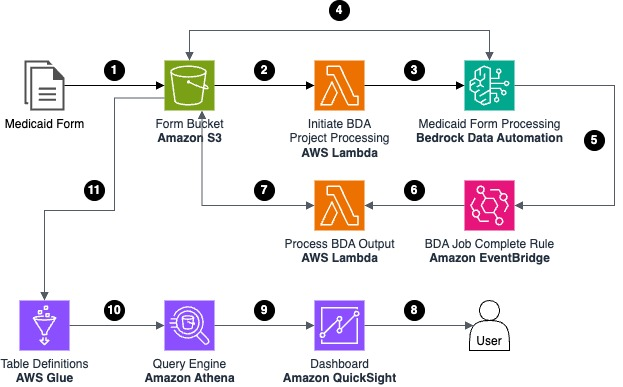
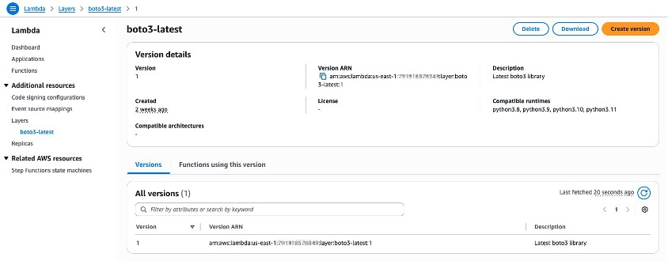
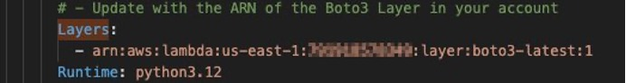
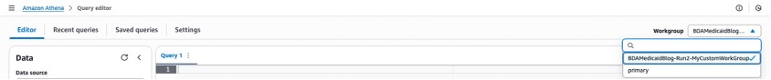
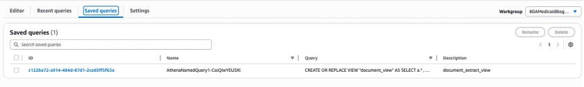
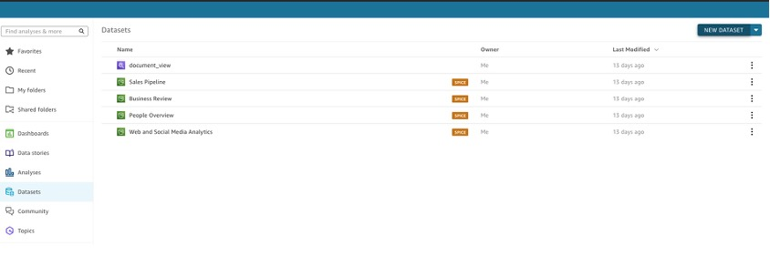

# Extracting, analyzing, and interpreting information from Medicaid forms with AWS Bedrock Data Automation

What if paper forms could be processed at the same speed as digital forms? What if their contents could be automatically entered in the same database as the digital forms? [Medicaid agencies](https://aws.amazon.com/stateandlocal/health-and-human-services/cloud-resources/#medicaid) could analyze data in near real-time and drive actionable insights on a single dashboard. Whether a provider submits claims electronically or on paper, the claim could be adjudicated using the same process and analyzed the same way, saving both time and money.

AI and machine learning (ML) services from Amazon Web Services (AWS) allow Medicaid agencies to create this streamlined solution. Moreover, AWS enables the adoption of solutions like this by providing no code or low code serverless services.

In a [previous walkthrough](https://aws.amazon.com/blogs/publicsector/extracting-analyzing-medicaid-forms-aws/), we used [Amazon Textract](https://aws.amazon.com/textract/) to extract the data from paper forms. In this walkthrough, we explore [Amazon Bedrock Data Automation](https://aws.amazon.com/bedrock/bda/) (BDA) to do the same. This solution incorporates a dashboard that provides visuals and insights from data extracted from paper-based forms. As providers upload paper-based forms into the system, the dashboard reflects these inputs in near real-time.

This walkthrough uses a Medicaid claims form as the example form to be processed. However, this solution is applicable to any paper-based form, such as Medicaid eligibility forms. This solution allows users to automate the processing of those paper based forms, reducing the time spent to do clerical work such as data entry.

## Solution overview

The following figure shows the solution architecture. The following steps describe this in more detail.



*Figure 1. The architecture overview of AWS services involved in the workflow, described in detail in the following section.*

1.  A new file is uploaded to the input prefix in the Amazon S3 bucket.

2.  The newly uploaded file triggers an AWS Lambda Function.

3.  The Lambda function invokes the BDA Project with a reference to the new file to be processed.

4.  The BDA Project invocation retrieves the new file and matches it to the Medicaid form blueprint. It extracts both the standard and custom outputs. This data is written to the output S3 bucket.

5.  When the BDA Project invocation completes, it sends a message to the Amazon EventBridge default message bus announcing the completion. The message also contains an Amazon Resource Name (ARN) to the output of the BDA Project invocation in the S3 bucket.

6.  An EventBridge rule invokes a Lambda in response to the message generate in Step 5.

7.  The Lambda function reads the custom output of the BDA Project invocation found in the output prefix, extracts the desired data fields, and writes them as a CSV file in the S3 bucket.

### Processed data viewing

1.  A user wanting to view the Medicaid form data accesses Amazon QuickSight and chooses the Medicaid form dashboard.

2.  QuickSight queries the Amazon Athena query engine to retrieve the requested data.

3.  AWS Glue Data Tables provide Athena with the schema information of the tables and the necessary details to query the underlying data on Amazon S3.

4.  The data stored in the S3 bucket is retrieved, formatted, and returned up the chain to QuickSight.

## Solution deployment overview

The BDA Medicaid form demo's resources are deployed through an AWS CloudFormation template. This template deploys the following resources:

- S3 bucket

  - *Input* folder for the drop-off of new Medicaid form files to be processed.

  - *Output* folder for BDA to place the output of its processes.

  - *ForGlue* folder for the refined data to be consumed by Athena.

- Lambda

  - NewFormToBDAProject, which is triggered when a new form is created in the S3 bucket *input* folder. Initiates BDA Project with a reference to the new file.

  - FromBDAProjectToS3, which is triggered by an EventBridge rule that detects when BDA has completed the processing of a form. The function reads the project's output and creates a CSV file containing the necessary fields. This file is placed in the *ForGlue* folder in the S3 bucket for use by the AWS Glue Tables.

- Bedrock blueprint

  - The blueprint describes the Medicaid form and the fields needed for extraction.

- BDA Project

  - This contains the configuration for processing forms by BDA, modalities, and blueprints.

- EventBridge rule

  - This rule detects the successful completion of the BDA Project invocation and triggers the FromBDAProjectToS3 Lambda function.

- AWS Glue Data Catalog

  - Data catalog to hold the table definitions.

- AWS Glue Table

  - Keyvalues: Table definition pointing to the S3 bucket ForGlue/keyvalues folder, which contains the singular data from the Medicaid forms.

  - Tablevalues: Table definition pointing to the S3 bucket ForGlue/tablevalues folder, which contains the treatment records on the Medicaid forms.

- Athena Named Query

  - The query used to create the view that joins the keyvalues and tablevalues tabesfrom the Medicaid form data.

- AWS Identity and Access Management (IAM) roles and policies

  - The CloudFormation template contains several roles and policies to enable the resources such as Lambda and EventBridge.

To deploy these resources, point to the Cloud Formation template. When naming the stack, makes sure that the name has only lower-case letters, numbers, dashes, and periods. Failure to follow this naming convention results in deployment failure.

## Solution deployment

The Medicaid BDA demo is deployed in two pieces. First is the CloudFormation template, which deploys most of the resources. Second is the configuration of QuickSight for the reporting dashboard.

### Prerequisites

The following prerequisites are necessary to complete this solution:

- Open AWS CloudShell.

- Run the following commands to create a Lambda layer for latest boto3:

  - First, create a directory for your layer:

    - mkdir -p boto3-layer/python

    - cd boto3-layer

  - Install the latest version of boto3 into the Python directory:

    - pip install boto3 -t python/

  - Create a zip file of the layer contents:

    - zip -r boto3-layer.zip python/

  - Now you have a zip file named boto3-layer.zip that contains the latest boto3 library.

  - To create the layer in Lambda, you can use the AWS Command Line Interface (AWS CLI):
    ```
    aws lambda publish-layer-version \\\
      \--layer-name boto3-latest \\\
      \--description \"Latest boto3 library\" \\\
      \--zip-file fileb://boto3-layer.zip \\\
      \--compatible-runtimes python3.9 python3.10 python3.11 python3.12 python3.13
    ```
On the Lambda Layers page, find the layer that you created, and copy the ARN.


### Deploy CloudFormation template

Download the Medicaid BDA Demo template from *here*.

1.  In the CloudFormation template, search for the Attribute 'Layers:' in the LambdaNewFormToBDAProject Lambda definition. Update the Layer attribute to the ARN of the layer that you deployed with boto3.

2.  Log in to the AWS Management Console and make sure that you are in the intended AWS Region for deploying the demo.

3.  Navigate to the **CloudFormation** service and choose **create stack**.

4.  In the **Create stack** screen, under **Prepare template**, choose **Choose an existing template.** Under **Template source**, choose **Upload a template file,** and choose the file downloaded in Step 1.

5.  Choose **Next**.

6.  Enter the Stack name (for example BDAMedicaidDemo)

7.  Choose **Next**.

8.  Check the **Acknowledgement** checkbox at the bottom of the screen and then choose **Next** to accept the default settings for the **Configure stack** options.

9. Review the chosen options and choose **Submit** to begin the stack deployment process.

10. Wait for the deployment to complete. It takes 3--5 minutes for the resources to be deployed. 

    

### Configure Athena View and QuickSight

Now that most of the resources have been deployed, the following steps create the view used by QuickSight. This view joins the Medicaid form's patient data with the lines of treatment information on the form.

1.  Navigate to **Amazon Athena**. If you are not in the Query editor, then choose the **Launch Query Editor** button.

2.  In the **Query editor** under **Workgroup**, choose the work group named **MyCustomWorkGroup**. The name of the workgroup, and other resources, are prefixed with the name of your AWS stack created in the previous section.

    

3.  In the **Query editor**, choose the **Saved queries** tab. Choose the query ID of the query named **document_extract_view**. This loads the SQL to create the view used by QuickSight into the **Query editor**. Choose the **Run** button to run the query.

    

4.  On the left side of **Query editor** you should see a section titled **Tables and views**. In this section confirm the presence of the **keyvalues** and **tablevaluse** tables. Furthermore, confirm the presence of the newly created view named **document_view**.

5.  To the right of **document_view** choose the kebab (three vertical dots) to display the context menu. In this menu choose **Preview view** and verify that a chosen query is created and executed to show the contents of the view. This is the view we use in QuickSight.

### QuickSight setup

Now that the view has been created, you enable QuickSight and configure your initial dashboard. If you haven't activated QuickSight in your stand-alone account or AWS Organization before, then you are entitled to a 30-day free trial.

1.  Navigate to the **QuickSight** service. In the **QuickSight Let's Get Started** screen, choose **Sign Up for QuickSight**.

2.  Provide an **email address** for notifications, make sure the **QuickSight region** matches the Region where the CloudFormation template was deployed, and provide a **QuickSight account name**.

3.  In the **Allow access and autodiscovery for these resources**, make sure that **Amazon Athena** and **Amazon S3** are chosen.

4.  In **Amazon S3**, choose **Select S3 buckets** to bring up the S3 bucket selection screen. Locate the S3 bucket deployed by the CloudFormation template in the previous section. When you locate the S3 bucket, choose the checkbox to the left of the bucket's name and the one to the right under **Write Permission for Athena Workgroup**. Make sure that both checkboxes are checked. 

5.  At the bottom of the page uncheck **Add Perfect-Pixel Reports,** then choose **Finish**.

6.  When your QuickSight account finishes creating, choose the **Go to QuickSight** button.

7.  Choose **Datasets** in the left navigation area, and choose **New dataset**.

    

8.  Choose **Athena,** then enter a data source name. Choose **MyCustomWorkgroup** from the Athena workgroup drop down options. Choose **Create data source**.

9. In the **Choose your table** window, choose **AwsDataCatalog** as the catalog and choose **documenttextract** as the database. Choose **document_view** as the table that you can visualize. Choose **Select**.

10. In the **Finish dataset creation** window, choose **Directly query your data** and choose **Visualize**.

11. In the **New sheet** window, choose **Create**.

12. To create a graph of charges for each **dayofservice**, drag the **charges** measure from the left side to the **Add a dimension or measure** area. Drag the **dateofservice** dimension from the left side to the **Add a dimension or measure** area.

13. Change **Change visual type** to **Vertical bar chart**. Observe the chart showing you charges by the date of service ascending.

14. Publish the analysis as a dashboard by choosing the **Publish** button in the top right corner of the screen. Provide a **Dashboard name** and choose **Publish dashboard.**

### Test the dashboard

Now that you have completed the setup, you can process some Medicaid forms to load data into the system.

1.  Download the sample Medicaid forms from these links: form1, form2, form3, and form4.

2.  Go to the **Amazon** **S3** service in the AWS Management Console. Go to the bucket created by the CloudFormation template.

3.  On the screen for the bucket, choose the **Create folder** button and enter "input" for the **Folder name**.

4.  Choose the **input** folder from the bucket object list. Now that you are in the **input** folder, choose the **Upload** button.

5.  On the **Upload** screen, choose the **Add files** button, and choose the sample forms downloaded in Step 1.

6. At the bottom of the **Upload** page, choose the **Upload** button.

7. When the upload completes, choose **Close**.

8. Go back to the root of the S3 bucket by choosing its name in the breadcrumbs at the top of the screen. Keep refreshing the object list until you see the **output** and **forglue** folders appear. This means that the processing has completed.

9. Return to **QuickSight** and choose **Dashboards** in the left menu. Choose the dashboard you created previously and verify that the dashboard is now showing dates and dollar amounts.

## Conclusion

This walkthrough outlines how to create a solution to extract relevant information from a paper-based Medicaid claims form using Amazon Bedrock Data Automation. This solution analyzes and helps interpret the extracted information with the use of a dashboard in near real-time.

Using a solution like this one enables a state Medicaid agency to run analytics on data extracted out of paper-based forms, in near real-time, without manual intervention to key in the data. All the data from the forms drives the insights on a dashboard. This allows the Medicaid agency to adjudicate and analyze claims in the same way, regardless of whether the provider submitted them electronically or on paper. This can help agencies save hours in staff resources, as data is extracted automatically and the staff doesn't have to manually enter data for each form.

Health and human services (HHS) agencies across the country are using the power of AWS to unlock their data, improve citizen experience, and deliver better outcomes. See more [Health and Human Services Cloud Resources here](https://aws.amazon.com/stateandlocal/health-and-human-services/cloud-resources/?awsm.page-health-and-human-services-experts-all=1). Learn more about how governments use AWS to innovate for their constituents, design engaging constituent experiences, and more at the [AWS Cloud for State and Local Governments hub](https://aws.amazon.com/stateandlocal/).

## Security

See [CONTRIBUTING](CONTRIBUTING.md#security-issue-notifications) for more information.

## License

This library is licensed under the MIT-0 License. See the LICENSE file.
